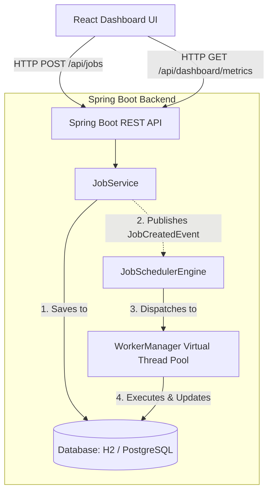
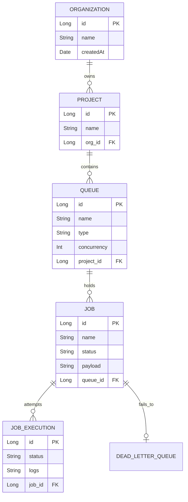

# Job Schedular - Project Deliverables

## 1. Source Code & Setup Instructions

### Prerequisites
- Java 21+
- Node.js 18+
- Maven 3.9+

### Backend Setup (Spring Boot)
Open a terminal, navigate to the `backend` directory, and run:
```bash
cd backend
mvn clean spring-boot:run
```
The backend API will start on `http://localhost:8080`.

### Frontend Setup (React / Vite)
Open a new terminal, navigate to the `frontend` directory, install dependencies, and start the dev server:
```bash
cd frontend
npm install
npm run dev
```
The frontend dashboard will be available at `http://localhost:5173`.

---

## 2. Architecture Diagram

The system follows a classic decoupled client-server architecture with an event-driven internal worker engine.



---

## 3. Entity-Relationship (ER) Diagram

The relational schema is highly normalized to support multi-tenant project isolation and strict job lifecycles.



---

## 4. API Documentation

### `GET /api/dashboard/metrics`
Returns system-wide telemetry data including active workers, currently executing jobs, and completion statistics for the dashboard charts.

### `GET /api/jobs`
Fetches a list of all jobs currently in the system, along with their timestamps and execution statuses.

### `POST /api/jobs`
Creates a new job. 
**Payload:**
```json
{
  "name": "Data Aggregation Task",
  "payload": "{\"target\": \"metrics\"}",
  "status": "PENDING"
}
```

### `GET /api/queues`
Retrieves all configured queues, including their concurrency limits and priority types.

---

## 5. Design Decisions & Trade-offs

### Database Polling vs. Event-Driven Execution
**Decision:** Implemented an Event-Driven architecture using Spring Application Events instead of relying solely on database polling for new jobs.
**Trade-off:** Traditional job schedulers often use a dedicated thread to poll the `jobs` table every few seconds (e.g., `SELECT * FROM jobs WHERE status = 'PENDING'`). While this guarantees that no jobs are missed, it introduces artificial latency and wastes database CPU cycles on empty queries. By using Spring Events (`JobCreatedEvent`), the exact moment a job is saved via the API, the execution engine is notified and dispatches the job to the thread pool instantly. This drastically reduces latency and database load.

### Concurrency: Java 21 Virtual Threads vs. Standard Thread Pools
**Decision:** Leveraged Java 21 Virtual Threads (`Executors.newVirtualThreadPerTaskExecutor()`) for the Worker Manager.
**Trade-off:** Standard OS-level thread pools (like `FixedThreadPool`) are heavy and limit the number of concurrent jobs you can run before running out of memory or thrashing the CPU. Virtual Threads, introduced in Java 21, are incredibly lightweight. We can spawn thousands of them concurrently for I/O bound tasks (like webhook calls or DB writes) without crashing the JVM. 

### Database Selection: Relational (PostgreSQL/H2) vs. NoSQL
**Decision:** Chose a strict relational schema using JPA/Hibernate over a NoSQL document store (like MongoDB).
**Trade-off:** A job scheduler requires strict ACID guarantees. If a job is claimed by a worker, we must guarantee that a network partition won't cause a second worker to claim the exact same job. Relational databases support strong consistency and row-level locking.

### Avoiding Complex "SKIP LOCKED" for the Prototype
**Decision:** Skipped native `SELECT ... FOR UPDATE SKIP LOCKED` queries in favor of simple state transitions for the prototype phase.
**Trade-off:** In a true multi-node cluster, workers need to atomically claim rows without blocking each other. The industry standard is `SKIP LOCKED`. However, writing native, database-specific SQL adds significant complexity and hurts portability. For this scope, the event-driven approach ensures jobs are dispatched efficiently in a single-node setup. 

---

## 6. Automated Tests
Critical functionality is covered by automated unit tests. The `JobServiceTest` specifically validates the event-driven publishing mechanics to ensure the execution loop triggers reliably. Run tests via: `mvn test` in the backend directory.
