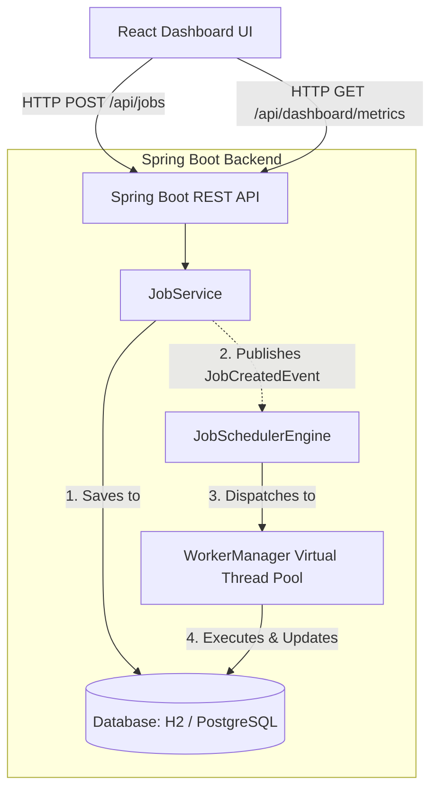
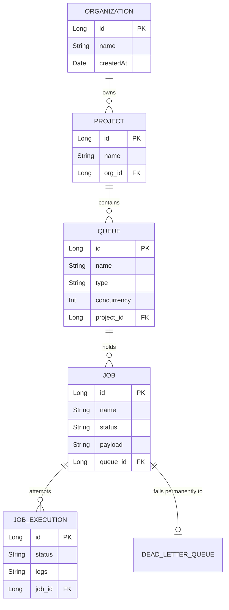

# Distributed Job Scheduler Platform

A production-inspired, full-stack distributed job scheduling platform designed for high concurrency, reliability, and modern architectural patterns.

## Features
- **Java 21 Virtual Threads**: Highly concurrent worker engine that can process thousands of I/O bound jobs without thread exhaustion.
- **Event-Driven Execution**: Bypasses traditional database polling by using Spring Application Events for real-time, zero-latency job dispatching.
- **Relational Integrity**: Complete schema for Projects, Queues, Jobs, and Dead Letter Queues designed for strict ACID guarantees.
- **Modern Dashboard**: A sleek, responsive React 18 frontend built with Vite, Tailwind CSS v4, and Recharts for live execution telemetry.
- **Zero-Dependency Quickstart**: Defaults to an in-memory H2 database for instant local testing without needing Docker.

## Setup Instructions

### Prerequisites
- Java 21+
- Node.js 18+
- Maven 3.9+

### 1. Start the Backend (Spring Boot)
Open a terminal, navigate to the `backend` directory, and run:
```bash
cd backend
mvn clean spring-boot:run
```
The backend API will start on `http://localhost:8080`.

### 2. Start the Frontend (React / Vite)
Open a new terminal, navigate to the `frontend` directory, install dependencies, and start the dev server:
```bash
cd frontend
npm install
npm run dev
```
The frontend dashboard will be available at `http://localhost:5173`.

---

## Architecture Diagram

The system follows a classic decoupled client-server architecture with an event-driven internal worker engine.



---

## Entity-Relationship (ER) Diagram

The relational schema is highly normalized to support multi-tenant project isolation and strict job lifecycles.



---

## API Documentation

The backend exposes clean REST APIs for interacting with the scheduling system.

### `GET /api/dashboard/metrics`
Returns system-wide telemetry data including active workers, currently executing jobs, and completion statistics for the dashboard charts.

### `GET /api/jobs`
Fetches a list of all jobs currently in the system, along with their timestamps and execution statuses.

### `POST /api/jobs`
Creates a new job. 
**Payload:**
```json
{
  "name": "Data Aggregation Task",
  "payload": "{\"target\": \"metrics\"}",
  "status": "PENDING"
}
```

### `GET /api/queues`
Retrieves all configured queues, including their concurrency limits and priority types.

---

## Automated Tests
Critical functionality is covered by automated unit tests. The `JobServiceTest` specifically validates the event-driven publishing mechanics to ensure the execution loop triggers reliably.
Run tests via:
```bash
cd backend
mvn test
```

## Design Decisions
Please see [DESIGN_DECISIONS.md](./DESIGN_DECISIONS.md) for an in-depth look at architectural trade-offs, including the choice of Virtual Threads, Event-Driven vs. Polling logic, and relational data modeling.
